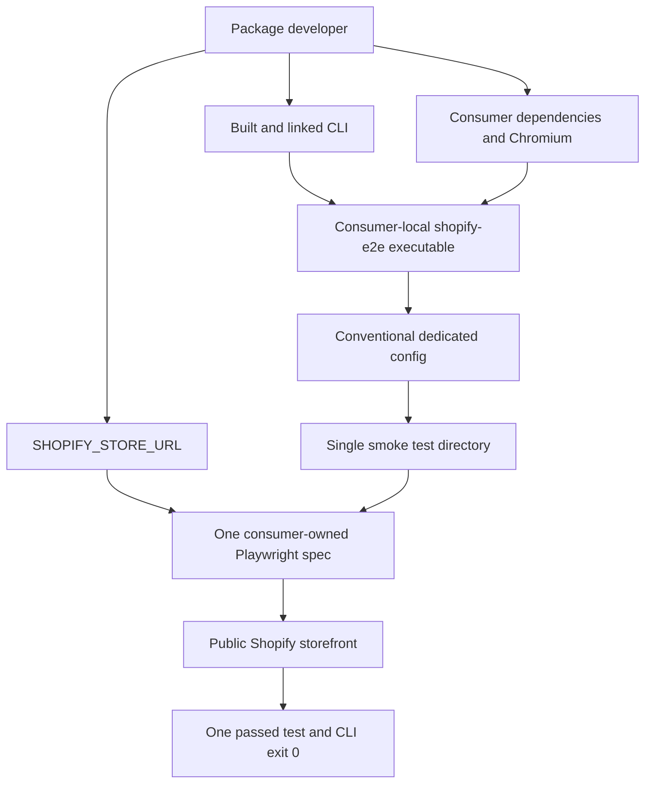

# Real-Store CLI Smoke Consumer - Plan

## Goal Capsule

| Field | Value |
|---|---|
| Objective | Add one manual consumer project that proves the current linked `@sematico/shopify-e2e` CLI can run one consumer-owned Playwright browser test against a real public Shopify storefront. |
| Authority hierarchy | The confirmed narrow scope in this plan governs the consumer; the existing CLI contract and phase-one limits remain unchanged. |
| Stop conditions | Stop if implementation requires a CLI/config change, package-owned browser lifecycle, authentication, store mutation, CI integration, or more than one smoke scenario. |
| Execution profile | Mostly scaffolding and integration proof; prefer install/link and runtime smoke evidence over new unit-test infrastructure. |
| Tail ownership | The implementer verifies repository quality gates and performs the documented manual smoke against an explicitly supplied storefront URL. |

---

## Product Contract

### Summary

Add a committed, manual-only test consumer whose sole job is to prove that the current linked CLI can launch consumer-owned Playwright and pass one browser navigation test against a real Shopify storefront URL supplied at runtime.

### Problem Frame

The automated fixture consumer already proves the packed CLI's command, configuration, isolation, worker, peer-resolution, and exit boundaries without requiring a browser or network access.
It does not give a developer a minimal place to confirm that the current local build can cross the final browser boundary and reach a real Shopify storefront.
The proof must stay deliberately smaller than a reusable Shopify E2E suite so it validates today's CLI without prematurely designing later storefront, browser-lifecycle, authentication, or helper APIs.

### Actors

- A1. **Package developer** — builds and links the current CLI, supplies a public Shopify storefront URL, installs the consumer's browser, and runs the smoke command from the consumer directory.
- A2. **Manual test consumer** — owns the supported Playwright peer, dedicated Shopify config, runtime URL validation, and single smoke spec.
- A3. **`@sematico/shopify-e2e` CLI** — applies its existing config, peer, test-root, worker, and process-outcome contracts without modification.
- A4. **Public Shopify storefront** — an external, unauthenticated HTTP(S) target used only for read-only document navigation.

### Requirements

| ID | Requirement |
|---|---|
| R1 | The repository must contain a clearly manual-only consumer project separate from `tests/fixtures/consumer`, whose automated installed-package role remains unchanged. |
| R2 | The consumer must be private, own exact `@playwright/test` version `1.61.1`, and invoke the locally linked `shopify-e2e` executable from its own working directory. |
| R3 | The consumer must provide one conventional `shopify-e2e.config.ts` containing only the required `testDir` field and selecting one directory with one Playwright smoke spec. |
| R4 | The smoke spec must require `SHOPIFY_STORE_URL`, accept only an absolute HTTP(S) URL, navigate to it in Chromium, and pass only when the final main-document response is successful. |
| R5 | Missing or invalid URL input, unavailable browser binaries, unreachable storefronts, and unsuccessful document responses must remain ordinary Playwright failures with trustworthy non-zero CLI outcomes. |
| R6 | The workflow must document the build/link boundary, consumer dependency installation, consumer-owned Chromium installation, runtime URL input, invocation directory, and expected success signal. |
| R7 | The smoke consumer must remain outside normal `npm run verify` and CI execution because it depends on a browser installation and an external store. |
| R8 | The work must not add or change CLI commands, flags, config fields, Playwright controls, browser lifecycle, authentication, helpers, mock servers, reusable storefront behavior, or persistent store actions. |

### Key Flow

- F1. **Run the current CLI against a real storefront**
  - **Trigger:** A1 wants to confirm that the current local CLI build crosses the installed execution and browser boundary.
  - **Actors:** A1, A2, A3, A4.
  - **Steps:** A1 prepares the consumer-owned dependencies and browser, links the built CLI, supplies `SHOPIFY_STORE_URL`, and starts the consumer's smoke command; A3 loads the conventional dedicated config, resolves A2's Playwright peer, and runs the single spec with its existing one-worker contract; the spec validates and visits A4.
  - **Outcome:** One Playwright test passes and the CLI exits `0`, or the existing Playwright/CLI boundary returns a non-zero outcome describing the failed prerequisite or navigation.
  - **Covered by:** R1-R8.

### Acceptance Examples

- AE1. **Covers F1 / R2-R4.** Given a built and linked CLI, installed consumer dependencies and Chromium, and a reachable public Shopify HTTP(S) URL, when the developer runs the smoke command from the consumer directory, then exactly one browser test passes and the CLI exits `0`.
- AE2. **Covers F1 / R4-R5.** Given the consumer is otherwise ready but `SHOPIFY_STORE_URL` is absent or not an absolute HTTP(S) URL, when the developer runs the smoke command, then the sole spec fails clearly without navigating and the CLI returns Playwright's non-zero result.
- AE3. **Covers F1 / R5-R6.** Given Chromium is not installed or the storefront cannot return a successful document response, when the developer runs the smoke command, then Playwright reports the runtime failure and the CLI preserves the non-zero outcome.
- AE4. **Covers R7-R8.** Given the repository's normal verification command runs, then it does not execute the real-store smoke consumer and the existing automated installed-package fixture remains unchanged.

### Success Criteria

- A developer can follow the committed consumer documentation from a current local build to one passing real-store Playwright result without importing repository source files directly.
- The proof resolves Playwright from the consumer, runs from the consumer directory, and uses the existing conventional CLI configuration unchanged.
- The committed spec performs only one read-only top-level navigation and has no dependency on theme selectors, products, accounts, cart state, checkout, or store configuration.

### Scope Boundaries

#### In scope

- One private manual consumer project.
- One supported Playwright dependency, one dedicated config, one smoke script, one browser spec, and focused usage documentation.
- Runtime validation of the required public storefront URL inside the consumer-owned spec.

#### Deferred to Follow-Up Work

- Turning the smoke consumer into automated, scheduled, or CI verification.
- Adding more storefront scenarios or store-specific expectations after a concrete product requirement exists.
- Capturing durable packaging or browser-boundary learnings in `docs/solutions/` after manual execution reveals something reusable.

#### Outside scope

- Any production CLI or configuration change.
- Package-owned browser installation, launch configuration, or lifecycle behavior.
- Password-protected stores, bot-challenge handling, authentication, accounts, cart, checkout, admin operations, writes, or persistent state.
- Mock applications, local servers, ordinary Playwright configuration, helpers, fixtures, selectors, screenshots, traces, reporters, retries, projects, or additional test files.

### Dependencies and Assumptions

- The target is a publicly reachable Shopify storefront that does not require a storefront password, authentication, special headers, or challenge completion.
- The developer can install Chromium using the consumer-owned Playwright installation.
- The package is built before it is linked because `bin/run.js` executes compiled output from `dist/`; local changes require rebuilding before another smoke run.
- Redirects are acceptable when navigation ends with a successful final main-document response.

---

## Planning Contract

### Key Technical Decisions

- KTD1. **Keep the manual proof beside, but separate from, the automated consumer fixture.** Create `tests/fixtures/storefront-smoke-consumer/` as an unreferenced sibling of `tests/fixtures/consumer/`. Its name and documentation make the manual network/browser dependency explicit, while placement under `tests/` keeps TypeScript and Biome coverage aligned with current root tooling.
- KTD2. **Model a real consumer without persisting a machine-specific package path.** The nested private ESM package pins `@playwright/test` to `1.61.1`, commits its dependency lock, and exposes an npm smoke script that resolves `shopify-e2e` from the consumer's local binary path after linking. Linking remains a documented developer action rather than a committed `file:` dependency.
- KTD3. **Use the existing closed config contract exactly.** The conventional config contains only `testDir` and points at the single smoke directory. Store URL, browser choice, timeout, and assertion behavior remain consumer-spec concerns because adding them to package config would expand the CLI product surface.
- KTD4. **Make navigation the entire storefront assertion.** The spec validates `SHOPIFY_STORE_URL` as an absolute HTTP(S) URL, performs one Chromium navigation through the Playwright page fixture, and requires a non-null successful final response after DOM content loads. It does not inspect theme content or interact with the page.
- KTD5. **Keep the proof manual and non-authoritative for release verification.** Existing `tests/installed-cli.test.ts` remains the deterministic black-box release gate. Repository verification checks the committed consumer statically but does not launch its spec; only the documented manual outcome proves the real browser boundary.

### High-Level Technical Design



### Output Structure

```text
tests/fixtures/storefront-smoke-consumer/
├── README.md
├── package.json
├── package-lock.json
├── shopify-e2e.config.ts
└── shopify-smoke/
    └── storefront.spec.ts
```

### Sequencing

U1 establishes the independent consumer boundary and its reproducible dependency/configuration contract.
U2 adds the only feature-bearing smoke behavior on top of that boundary.
U3 documents the end-to-end manual proof and makes it discoverable without adding it to automated verification.

---

## Implementation Units

### U1. Scaffold the manual consumer boundary

- **Goal:** Create a reproducible, private consumer package that owns Playwright and selects exactly one dedicated smoke directory through the existing CLI contract.
- **Requirements:** R1-R3, R7-R8; AE4.
- **Dependencies:** None.
- **Files:** Create `tests/fixtures/storefront-smoke-consumer/package.json`, `tests/fixtures/storefront-smoke-consumer/package-lock.json`, and `tests/fixtures/storefront-smoke-consumer/shopify-e2e.config.ts`.
- **Approach:** Mirror the private ESM identity and conventional config shape in `tests/fixtures/consumer/`, while adding only the exact supported Playwright dependency and a consumer-local smoke script. Generate a nested lockfile from that manifest without saving the linked CLI or any absolute local path. Keep the config to its one allowed key and point it at `shopify-smoke`.
- **Execution note:** This is packaging/configuration work; establish the consumer install and config boundary before adding the browser spec, and prefer static/install smoke evidence over new test harness code.
- **Patterns to follow:** `tests/fixtures/consumer/package.json`, `tests/fixtures/consumer/shopify-e2e.config.ts`, the peer range in `package.json`, and config validation in `src/config/load-config.ts`.
- **Test scenarios:**
  1. Install the nested consumer dependencies and confirm the resolved `@playwright/test` version is `1.61.1` from the consumer package rather than inherited from repository source imports.
  2. Link the current built CLI without saving a machine-specific dependency and confirm the consumer script resolves the local `shopify-e2e` executable from the consumer working directory.
  3. Run repository static gates and confirm the nested TypeScript config remains valid and contains no unsupported CLI config fields.
- **Verification:** The nested package installs reproducibly, contains no persisted local CLI path, and the existing CLI reports the new conventional config and smoke directory when invoked from that consumer.

### U2. Add one real-store browser smoke spec

- **Goal:** Prove that consumer-owned Playwright launched by the current CLI can navigate Chromium to one real public Shopify storefront and return a trustworthy result.
- **Requirements:** R3-R5, R8; F1; AE1-AE3.
- **Dependencies:** U1.
- **Files:** Create `tests/fixtures/storefront-smoke-consumer/shopify-smoke/storefront.spec.ts`.
- **Approach:** Keep URL parsing and validation inside the consumer spec, then perform one top-level navigation with the DOM-content-loaded milestone and assert that the final main-document response exists and is successful. Use only Playwright's public test and page APIs. Do not add theme selectors, retries, custom timeouts, config files, helpers, or page interactions.
- **Execution note:** Start by proving the missing/invalid URL failure locally, then run the same single spec against a reachable public storefront; do not broaden the test when the first successful browser boundary is established.
- **Patterns to follow:** Consumer-owned imports and test shape under `tests/fixtures/consumer/`, the generated one-worker configuration in `src/playwright/generated-config.ts`, and current exit propagation in `src/process/run-child.ts`.
- **Test scenarios:**
  1. Given a reachable public Shopify HTTP(S) URL and installed Chromium, the spec navigates once, receives a successful final response, passes, and the CLI exits `0`.
  2. Given no `SHOPIFY_STORE_URL`, the spec fails before navigation with a clear prerequisite message and the CLI returns Playwright's non-zero test result.
  3. Given a relative URL, malformed URL, or non-HTTP(S) scheme, the spec rejects it before navigation and returns a non-zero result.
  4. Given Chromium is absent, Playwright reports its launch/install failure and the CLI preserves the non-zero outcome.
  5. Given DNS, TLS, timeout, or unsuccessful final-response failure from the target, the spec fails without fallback behavior or mutation and the CLI preserves the non-zero outcome.
- **Verification:** Exactly one Playwright test is selected; success proves a real Chromium navigation through the linked CLI, while each prerequisite/navigation failure remains legible and non-zero.

### U3. Document and expose the manual proof workflow

- **Goal:** Make the smoke consumer usable without implying that it is an automated release gate or a broader Shopify testing framework.
- **Requirements:** R6-R8; AE1, AE4.
- **Dependencies:** U1, U2.
- **Files:** Create `tests/fixtures/storefront-smoke-consumer/README.md`; modify `README.md`.
- **Approach:** Keep detailed preparation and invocation guidance next to the consumer, and add a short root-level pointer under package verification. Document the current-build requirement, non-saving link behavior, consumer dependency and Chromium ownership, required runtime URL, consumer-directory invocation, expected one-test/exit-zero result, common prerequisite failures, and manual-only status.
- **Patterns to follow:** The concise install/config/run/verification organization in `README.md` and the package's phase-one ownership language.
- **Test scenarios:** Test expectation: none — this unit changes documentation and discoverability only; U1-U2 and the Verification Contract prove the described behavior.
- **Verification:** A developer unfamiliar with the fixture can identify why it exists, prepare it without persisting local machine paths, run it against a public storefront, interpret the result, and understand that normal verification does not execute it.

---

## Verification Contract

| Gate | Applies to | Required outcome |
|---|---|---|
| `npm run lint` | U1-U3 | Root Biome checks accept the nested manifest, config, spec, and documentation-adjacent changes covered by current tooling. |
| `npm run typecheck` | U1-U2 | The nested TypeScript config and smoke spec typecheck with the repository's strict test configuration. |
| `npm run verify` | U1-U3 | Existing fast and installed-package suites remain green; the real-store smoke spec is not discovered or executed by Vitest or the installed-package gate. |
| Nested consumer dependency inspection | U1 | The consumer resolves exact Playwright `1.61.1`, has no saved machine-specific CLI path, and exposes the smoke command through its local binary context. |
| Missing/invalid URL manual negative check | U2 | The sole spec fails before navigation and the CLI exits non-zero with an actionable prerequisite failure. |
| Real-store manual smoke | U1-U3 | From the prepared consumer, a reachable public Shopify URL produces one passed Chromium test, selected-boundary diagnostics, and CLI exit `0`. |

---

## Definition of Done

- The complete Output Structure exists and contains only the planned consumer artifacts.
- R1-R8 and AE1-AE4 are satisfied without modifying production code, package CLI metadata, root verification scripts, or the existing automated fixture consumer.
- U1's nested package owns exact Playwright `1.61.1`, installs reproducibly, and does not commit a local CLI path, store URL, browser binary, test output, or secret.
- U2 contains exactly one spec and performs only validated read-only navigation to `SHOPIFY_STORE_URL` with no theme or business-flow assumptions.
- U3 clearly distinguishes this manual browser/network smoke from deterministic automated release verification.
- All repository quality gates pass, the missing/invalid URL behavior is verified, and one real public Shopify storefront run completes with one passed test and exit `0`.
- No launch-blocking open question remains; target-store availability and network conditions are runtime prerequisites, not implementation uncertainty.

---

## Appendix

### Sources and Research

- `README.md` — authoritative install, config, run, phase-one limits, exit behavior, and package-verification contracts.
- `package.json` — supported Node/Playwright versions, local command scripts, package identity, and published-file boundary.
- `tests/fixtures/consumer/` — current private ESM consumer, dedicated config, and consumer-owned Playwright test patterns.
- `tests/installed-cli.test.ts` — deterministic packed-package gate and the reason the real-store proof must remain separate and manual.
- `src/config/load-config.ts` — closed one-field dedicated config contract.
- `src/playwright/peer.ts` and `src/playwright/generated-config.ts` — consumer-root peer resolution and package-owned one-worker config boundary.
- Git history around `da9883e` through `b9e01b5` — installed-consumer isolation and runtime-boundary decisions that this smoke consumer must exercise without expanding.
- No `docs/solutions/` or `CONCEPTS.md` corpus exists at this commit; current code and documentation are the local source of truth.

### Research Decision

External research was intentionally skipped because the repository already contains multiple direct, current examples of the exact consumer, Playwright, configuration, linking/install, and execution boundaries needed for this plan. No external finding is load-bearing.
